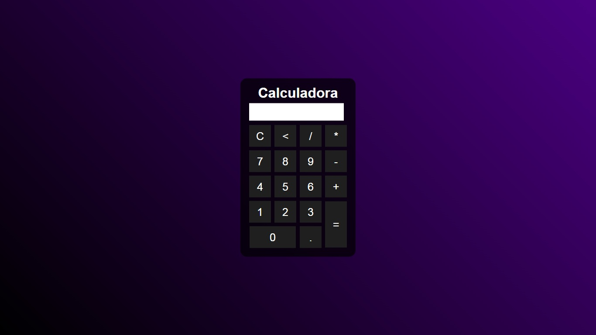

## Olá! Eu sou o Paulo Sheliga

Este projeto consiste em uma pagina de uma calculadora simples usando apenas elementos HTML, CSS e Javascript 

<a href="https://github.com/Sheliga">
  
 
      
      
      
  

</a>
 

 
